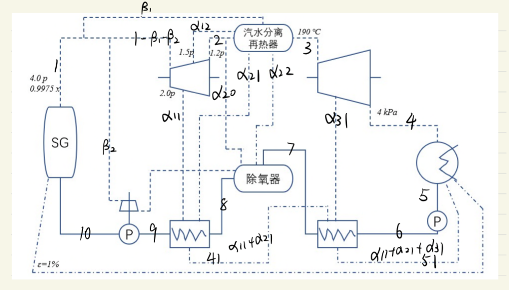

# 热力系统设计与实践：复杂热力系统计算  

## Question

*蒸汽发生器出口压力为4.0 MPa，干度0.9975，发电机输出功率为100 MW。  
高压缸效率0.98；低压缸效率0.98；发电机效率0.99；给水泵汽轮机效率0.90；给水泵效率0.60；  
根据课程知识，补充热力分析所需的状态参数，计算系统效率。*

  

## Answer

对热力系统进一步标注，如图  

  

其中根据汽水分离再热器，除氧器，冷凝器以及给水加热器的结构对质量和能量进行了一些简化假设。  

系统效率有  

$$
\eta = \eta _{me}( \eta _{mt1} \frac{W_{1}}{Q}+ \eta _{mt2} \frac{W_{2}}{Q})
$$

由于$\eta _{mt}$均为0.98，上式可以简化为  

$$
\eta = \eta _{me}\eta _{mt} \frac{W_{net}}{Q}
$$  

其中  

$$
W_{net} = W_{1}+W_{2}
$$  

$W_1$, $W_2$ 是汽轮机高压缸和低压缸做功。  

根据  

$$
\Delta E + W = Q 
$$  

有  

$$
W_1 = (1 - \beta_1 - \beta_2)h_1 - \alpha_{11}h_{11} - \alpha_{12}h_{12} - (1 - \beta_1 - \beta_2 - \alpha_{11} - \alpha_{12})h_2
$$  

$$
W_2 = (1 - \beta_1 - \beta_2 - \alpha_{11} - \alpha_{12} - \alpha{20})xh_3 -\alpha_{31}h_{31} - [(1 - \beta_1 - \beta_2 - \alpha_{11} - \alpha_{12} - \alpha{20})x - \alpha_{31}]h_4
$$  

其中包含了大量的未知数，需要根据热力系统各部分的质量守恒，能量守恒方程求解。  

进一步简化，不考虑经过泵的焓升，忽略$\epsilon=1\%$

简化后的主流的温熵图如图所示  

